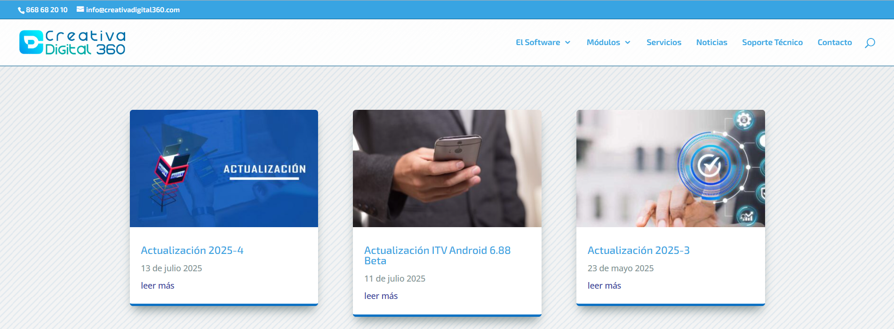
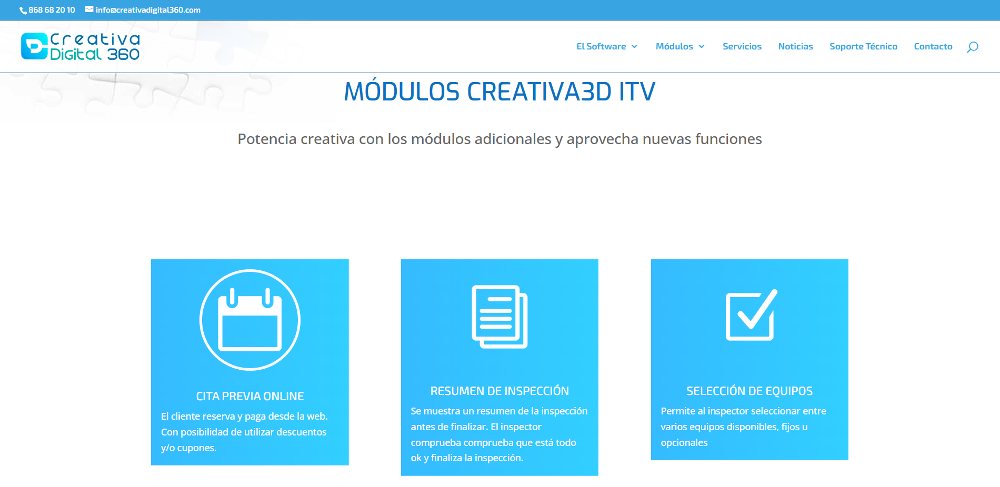

# Novedades y actualizaciones

Para ver un listado de las novedades de cada versión visita nuestra página web [programaitv.com/actualizaciones](https://programaitv.com/actualizaciones/).

Puedes ver todos los módulos disponibles y los nuevos visitando [programaitv.com/modulos](https://programaitv.com/modulos).

Puedes ver todos nuestros servicios visitando [programaitv.com/servicios](https://programaitv.com/servicios).

Recientemente hemos incorporado la emisión de certificados digitales para empleados de ITV y de la DGT (certificado cualificado de persona física empresa).

Para saber más, visita [programaitv.com/servicios/certificados-digitales](https://programaitv.com/servicios/certificados-digitales).
