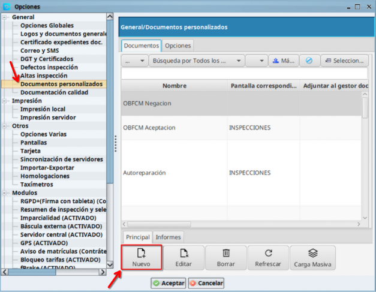
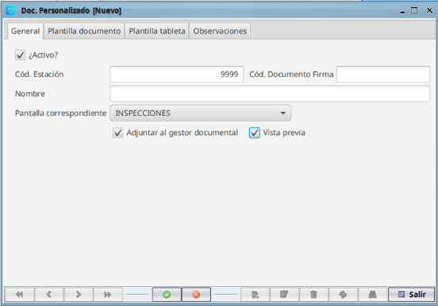
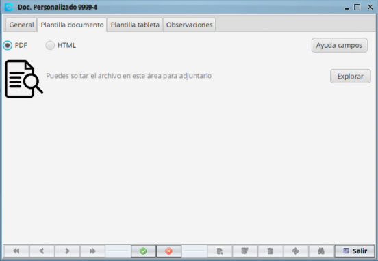
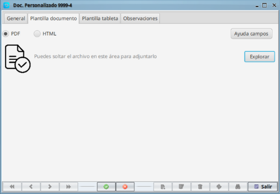
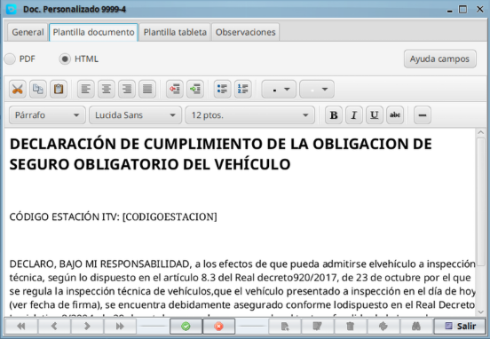
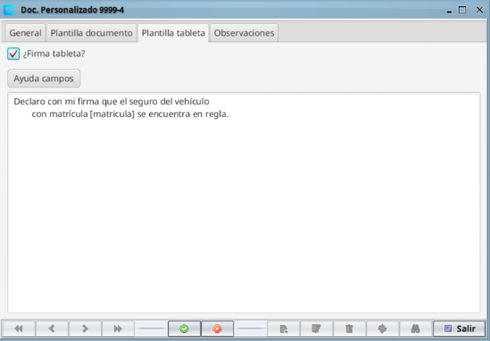
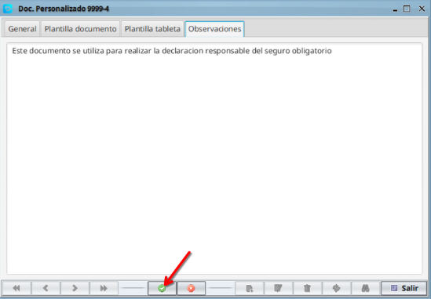
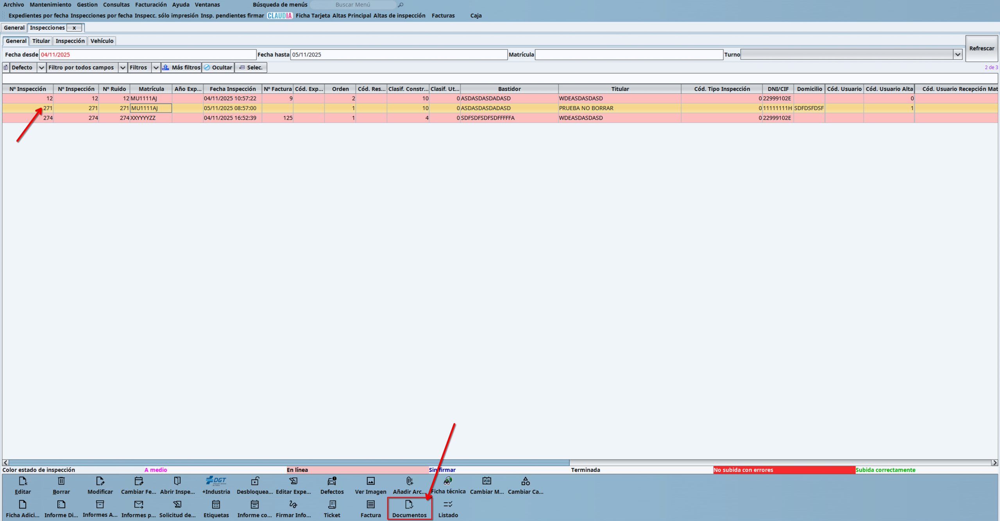
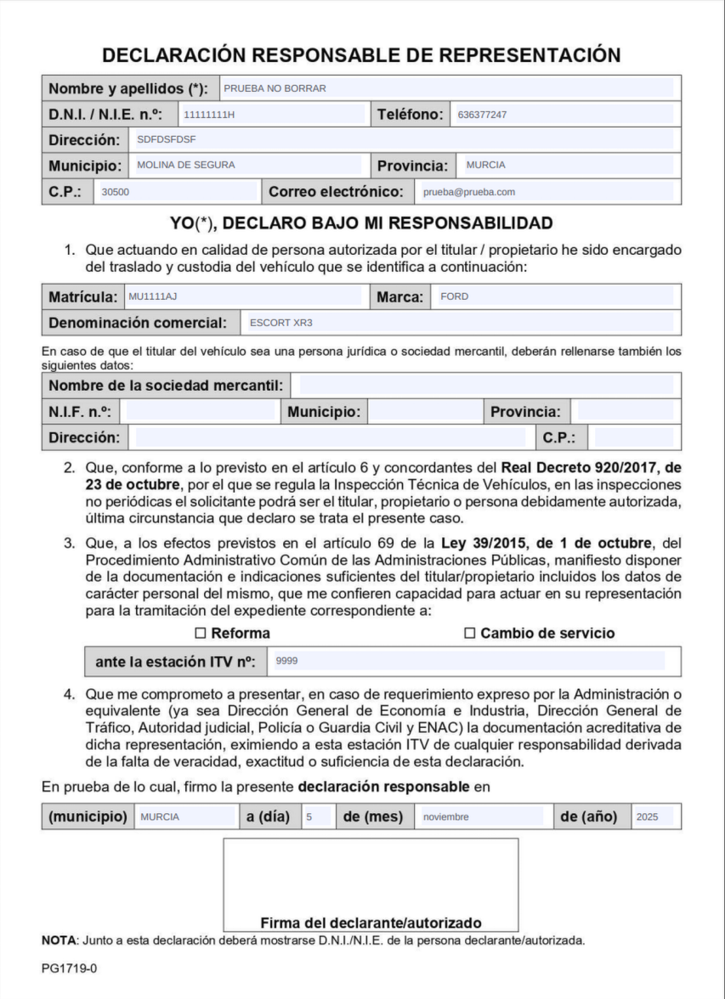

## Configuración y uso de documentos personalizados en CD360

El software de Creativa Digital 360 ha incorporado un nuevo sistema de gestión de documentos, el cual permitirá configurar documentos/formularios autorrellenables.

Con esto se podrán agilizar los trámites, evitando tener que rellenar manualmente todos aquellos campos de los que el programa de gestión ya tenga los datos guardados, como pueden ser los datos del cliente, vehículo, estación, etc.

Estos documentos se podrán configurar también para registrar la firma obtenida desde la tableta de firma (aquellos que dispongan del módulo de firma tableta), y se podrán guardar en el servidor, así como mostrar una vista previa de los mismos para su posterior impresión en papel.

En este documento se tratarán los siguientes temas:

- Creación de un nuevo documento.
    - Pestaña general.
    - Pestaña plantilla documento.
    - Pestaña plantilla tableta.
    - Pestaña observaciones.

!!! Note "Información de interés"

    Para poder utilizar la firma por tableta, es necesario tener activo el módulo de *Firma tableta*

### Creación de un nuevo documento

Para la creación de un nuevo documento tenemos que acceder a **Archivo > opciones > general > documentos personalizados.**

Una vez ahí pulsamos en **Nuevo**.

En la pestaña general podemos configurar:

- **Documento activo**. Si está deshabilitado no nos aparecerá el documento cuando queramos generarlo.
- **Cód. Estación y Cód. Documento firma**. Son campos de información, que no son editables.
- **Nombre**. Nombre con el que queramos que aparezca el documento cuando lo busquemos.
- **Pantalla correspondiente**. Pantalla desde la que queremos utilizar el documento. Puede ser **inspecciones, expedientes ó clientes**.
- **Adjuntar al gestor documental**. Si seleccionamos esta opción, al generar el documento, éste se guardará en el servidor junto a los archivos de la inspección, expediente ó cliente.
- **Vista previa**. Si seleccionamos esta opción, al generar el documento, se mostrará una vista previa del documento con la aplicación por defecto que haya configurada para mostrar archivos .pdf.

!!! Info "Checks adjuntar al gestor documental y vista previa sin seleccionar"

    Si los check de adjuntar al gestor documental y el de vista previa están sin seleccionar, la pestaña de **Plantilla documento** aparecerá deshabilitada. Este caso es únicamente para recoger la firma del cliente sin necesidad de asociarla a ningún documento. Es necesario tener activo el módulo de firma tableta.

Una vez que hayamos configurado los puntos anteriores, pasamos a la pestaña **Plantilla documento.**

Aquí podremos adjuntar ficheros .pdf ó configurar un HTML.

- **Ficheros PDF.** En este caso, podemos arrastrar el fichero en el área indicada ó pulsar sobre **explorar** para buscarlo.

    !!! Info "Campos rellenables automáticos"

        Para generar campos que se rellenen automáticamente al generar el documento, se puede utilizar el botón de **ayuda campos**. 
        En el caso de los pdf, es necesario configurar anteriormente el documento base como formulario editable en el que la ref. de cada campo corresponda con las combinaciones disponibles.

    Una vez que el fichero haya sido añadido, el icono del documento cambiará de la lupa a un check.

- **Ficheros HTML.** En este caso, podemos escribir directamente en el editor el texto que queremos configurar. 

    !!! Info "Campos rellenables automáticos"

    Para generar campos que se rellenen automáticamente al generar el documento, se puede utilizar el botón de **ayuda campos**. Ahí podrás encontrar todas las combinaciones disponibles.

    !!! Note "Información de interés"

        En el caso de los documentos HTML, éstos se generarán con un encabezado con los datos de la estación y el cliente, y un pie de página con la firma y fecha de firma.

Pestaña **Plantilla tableta**

Desde aquí podemos configurar el texto que aparece en la pantalla de la tableta de firma, y mediante el check **¿Firma tableta?** estableceremos si queremos que al generar el documento, la tableta de firma se active para recoger la firma del cliente.

!!! Note "Información de interés"

        Hay que tener en cuenta que la pantalla de la tableta de firma es limitada, por lo que hay que verificar si el texto configurado no se sale del espacio de la tableta. Si el texto es demasiado largo, hay que configurarlo con saltos de línea.

Finalmente en la pestaña **Observaciones**, podemos anotar un resumen sobre el tipo de documento. Es un campo opcional.

Para confirmar el documento, debemos pulsar en el check verde que aparece en la parte baja de la ventana. Y el proceso quedaría finalizado.

### Uso de documentos personalizados
Para utilizar los documentos personalizados creados en el apartado anterior, debemos situarnos en la ventana de **Inspecciones por fecha, expedientes ó clientes**, dependiendo de la ventana que hayamos configurado al dar de alta el documento en **Pantalla correspondiente.** 

- Ejemplo de generación de un documento desde **Inspecciones por fecha.**

    Para generar un documento que hayamos configurado previamente, debemos seleccionar la inspección a la que se lo queremos asignar, y pinchar sobre el botón **Documentos ó Documentos firma** (esto depende de la versión).

    Una vez hecho eso, nos aparecerá un desplegable en el que dispondremos de todos los documentos disponibles para inspecciones.
    Seleccionamos y aceptamos.

Éste sería un ejemplo de documento pdf autorrellenable generado.

