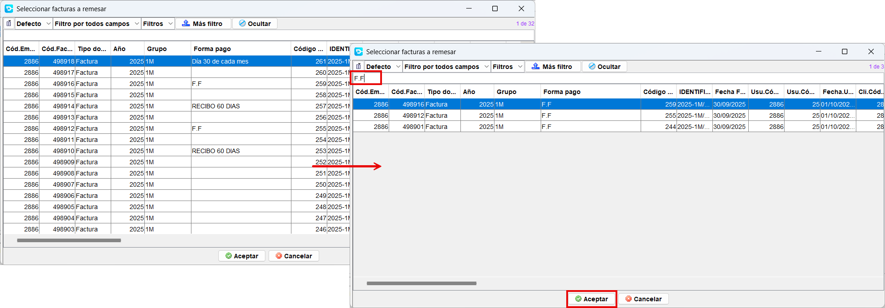
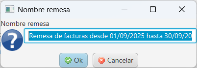
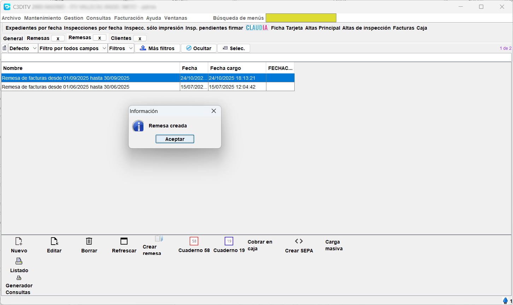
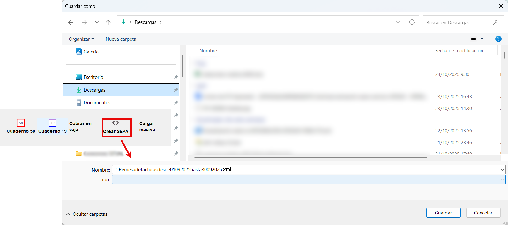

# Remesas bancarias

Creativa permite generar remesas para mandarlas al banco. Para ello, es necesario que tanto clientes como facturas cumplan una serie de características.

Los clientes deben tener especificada una forma de pago compatible con las remesas (F.F., Recibo domiciliado 30 días, etc) y tener cuenta bancaria (IBAN) asignada.

Una vez que se hayan generado las facturas mensuales a partir de sus albaranes, será cuando se proceda con la generación de una o varias remesas, que a su vez, generarán sendos ficheros para subir al banco.

### Generar una remesa bancaria

Accede al menú *Facturación > Remesas*.

{ align=left width="400" }
Pulsa en el botón *[Crear remesa]* (1), abriendose la pantalla formulario de la nueva remesa (2).

Introduce las fechas entre las que se deben buscar facturas a remesar, el grupo o serie de facturas (si se deja en blanco se mostraran todas), un importe mínimo y opcionalmente un cliente (si no se elije ninguno se mostrarán todos).

Al pulsar aceptar, se mostrará la pantalla con la lista de facturas a remesar.

Usa el filtro para dejar solo aquellas que queramos remesar en esta vez. Puedes filtrar por la forma de pago, por el cliente, por ambas cosas a la vez. Puedes usar los filtros como en el resto de la aplicación.

Una vez tengas las facturas seleccionadas, pulsa *[Aceptar]* y da nombre a la nueva remesa que se va a crear.

Se habrá creado la nueva remesa, que podrá ser exportada a Cuaderno 54, Cuaderno 19 y/o Sepa XML.

Ahora es el momento de exportar el fichero que hay que subir al banco. Debes pulsar sobre Cuaderno 58 (obsoleto), Cuaderno 19 (obsoleto) o **SepaXML**.

Selecciona la remesa recién creada y pulsa sobre SEPA XML. Se abrirá una ventana para guardar el fichero con el nombre y la extensión XML donde tu elijas.

Ahora solo tienes que localizarla y subirla a la web del banco que uses.