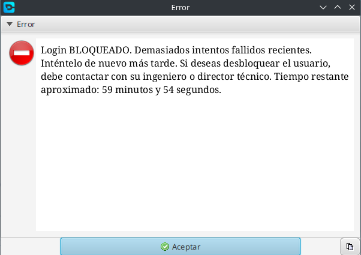
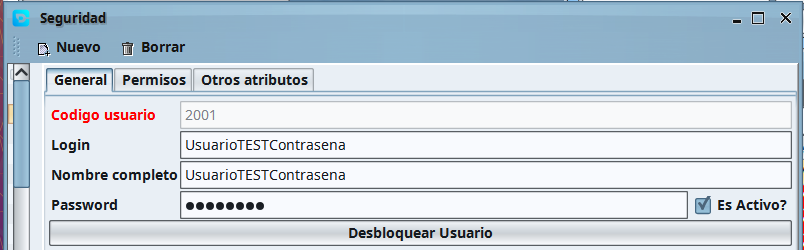
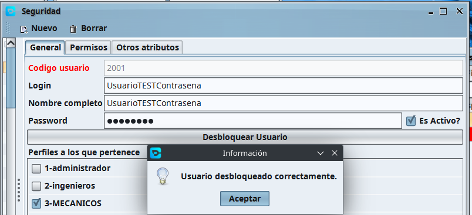

## Desbloquear usuario tras cinco intentos

En la última versión se ha añadido que, si un usuario intenta iniciar sesión y pone mal la contraseña cinco veces, entonces saldrá un mensaje de que el usuario ha sido bloqueado durante una hora y si se quiere desbloquear entonces debe hacerlo un perfil que tenga acceso a Archivo > Seguridad (en algunas estaciones solo funcionará con el perfil Administrador y en otras podrían los ingenieros y administradores).

En la siguiente imagen se muestra el mensaje de bloqueo:

Entonces le deberemos pedir a nuestro superior que nos desbloquee el usuario o esperar una hora. Si nos vamos a Archivo >Seguridad y vamos al usuario bloqueado veremos que hay un botón de desbloquear:

Le damos click y entonces el usuario será desbloqueado correctamente:

Ahora el usuario bloqueado podrá acceder sin problema a la aplicación de gestión.
