## La interfaz de usuario

En esta sección se describen las diferentes partes de la pantalla que ves como usuario.

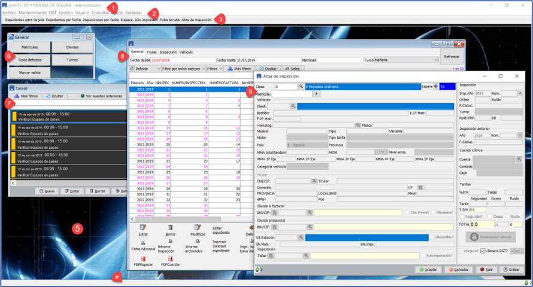

#### Barra de título

Muestra información sobre la aplicación, sobre la estación de ITV y el usuario que está utilizando la aplicación actualmente.

#### Barra de menús

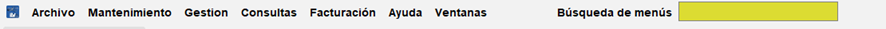

Es donde están todas las opciones disponibles en el programa. Los menús principales son:

* Archivo  
* Mantenimiento  
* Gestión  
* Consultas  
* Facturación  
* Ayuda  
* Ventanas  
* Búsqueda de menús, que es una utilidad para buscar cualquier opción que haya dentro de los diferentes menús.

| Nota: Cada usuario tiene o puede tener una configuración en cuanto a permisos que impida ver todas las opciones que se muestran en el manual. |
| :---- |

#### Barra de accesos rápidos

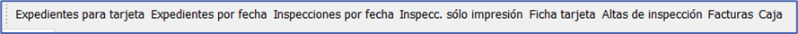

En la barra de accesos directos se muestran las opciones más utilizadas durante el trabajo diario de la estación.

#### Barra de estado

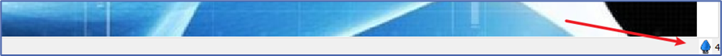

En la barra de estado se muestra información relevante a las operaciones que se están realizando, como mensajes que alertan sobre el estado del software o alguna de sus funciones y el estado de alguno de los procesos que se están ejecutando, ya sean de forma puntual, ya sean de forma permanente.

**Notificaciones**

En la zona derecha, se encuentra la zona de notificaciones, que muestra en forma de mensajes emergentes los diferentes estados, alertas o errores que se producen durante la ejecución de las diferentes actividades o tareas que realiza el software.

Una vez que la alerta se ha pasado, los mensajes permanecen ocultos en el icono de notificaciones, señalado con una flecha en la imagen anterior. Una cifra indica el número de mensajes que hay.

Para mostrar la información que hay oculta, se pulsa el icono de la bombillita, que muestra la ventana de notificaciones.

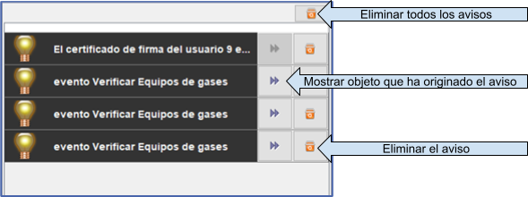

Las notificaciones o avisos, se pueden volver a ocultar pulsando de nuevo sobre el icono de las notificaciones, o bien para ir al evento que las ha generado, se puede pulsar sobre el botón que tienen al lado.

Para eliminar las notificaciones, se pulsa sobre la papelera que hay al lado de cada una de las notificaciones o para eliminarlas todas, en la papelera que hay en la parte superior.

Barra de progreso de los procesos

Si se ha efectuado alguna operación que requiere tiempo para llevarse a cabo, en la barra de estado aparecerá su progreso.

Si el proceso que se está ejecutando es permanente (no finaliza hasta que es abortado o se cierra el programa) entonces la barra de progreso marcará siempre el 50% y el nombre del proceso.

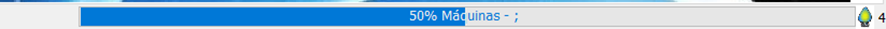

#### Fondo de escritorio de la aplicación

Es la zona común de la aplicación (punto 5 en ilustración 11\) que contiene todas las ventanas. Puede personalizarse la imagen accediendo al menú *Ventanas \> Cambiar fondo*.

#### Ventanas de botones rápidos

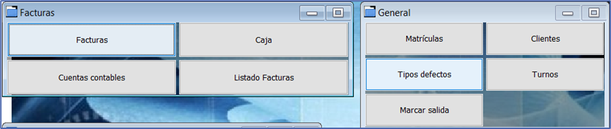

Se muestran en esta ventana una serie de botones con acceso a procesos de utilidad.

!!! Nota

    Estas funciones que aparecen en la imagen no son configurables.

#### Ventana de tareas

Creativa Digital 360 ITV contiene un gestor de tareas, que se puede mostrar en la pantalla de inicio.

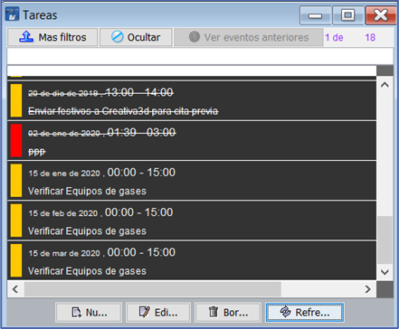

Esta pantalla contiene una lista de las tareas actualmente creadas, mostrando la descripción, el estado y la importancia.

Estas tareas pueden ser genéricas o estar asignadas a algún usuario.

Si quieres utilizar el sistema de tareas, puedes hacerlo desde esta misma pantalla, desde el menú *Gestión > Tareas* o bien desde la sección CRM que tiene cada cliente en su ficha en el menú *Mantenimiento > Clientes y dentro de la ficha de un Cliente > CRM > Tareas*.

Desde esta ventana se pueden dar de alta, eliminarlas, modificarlas o marcarlas como realizadas.

**Avisos o notificaciones generados por las tareas**

Los avisos que generan las tareas aparecen en la barra de estado y se pueden consultar en la zona de avisos de esta. Si son tareas genéricas se mostrarán los avisos en todos los equipos de la estación, pero si están asignadas a un usuario, solo se mostrarán en el equipo que esté usando el usuario al que están asignadas y al creador.

Para saber más sobre Tareas, consulta la sección específica del manual.

#### Pantallas de trabajo

Las pantallas de trabajo son aquellas en las que nos muestra un listado de inspecciones, clientes, expedientes, matrículas, etc. y contienen una tabla con información.

Están compuestas por 4 secciones comunes a todas:

**Filtro primario**

Donde se acota la información que se quiere mostrar usando diferentes pestañas y/o campos predeterminados.

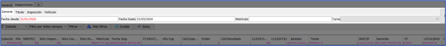

**Filtros**

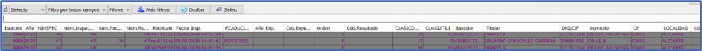

La información que se muestra en la tabla se puede filtrar utilizando el filtro básico, el multicolumna o el filtro avanzado. Permite reducir y acotar la información que interesa con respecto a la mostrada.

**Tabla de datos**

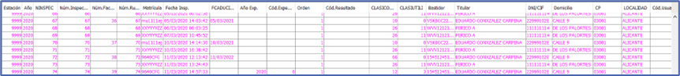

**Zona de botones**

Acciones que se pueden realizar con la información que se muestra actualmente en la pantalla.

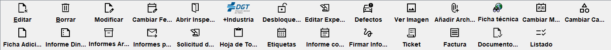

Todas las pantallas de trabajo, en donde se muestra una tabla de registros, comparten ciertos botones. Estos son comunes en todas ellas, por lo que se describen a continuación su función.

* **Nuevo**: Crea un nuevo registro. Muestra un formulario para rellenar según acorde al tipo de tabla en la que se encuentre.  
* **Editar**: Modifica los datos de un registro. Muestra un formulario con los datos del registro seleccionado para su edición.  
* **Borrar**: Borra el registro o registros seleccionados. Si el/los registros están relacionados con otra información, puede que muestre una alerta mostrando un error. En ese caso, habría que eliminar primeramente los datos relacionados.  
* **Refrescar**: Actualiza el contenido de la tabla. En muchos casos, al trabajar con la aplicación de gestión desde muchos puestos, puede que convenga refrescar los datos antes de realizar operaciones que impliquen nuevos registros o eliminación de registros.  
* **Listado**: Vista por pantalla formateada en A4 para su impresión en papel o guardado en PDF.

#### Pantalla de alta de Inspección

Disponible en *Gestión > Altas de Inspección* o en la *barra de accesos directos*.

Es la pantalla que se muestra cada vez que se realiza una nueva inspección y es donde se introducen todos los datos relativos a la inspección, como lo son, los datos del vehículo, los datos de los intervinientes (cliente titular, cliente presencial y cliente a facturar), datos de la estación, cita previa y otros datos.

En esta pantalla también se establecen los datos de próxima caducidad, la tarifa, los descuentos si los hay, etc.. todos ellos de forma casi automática.

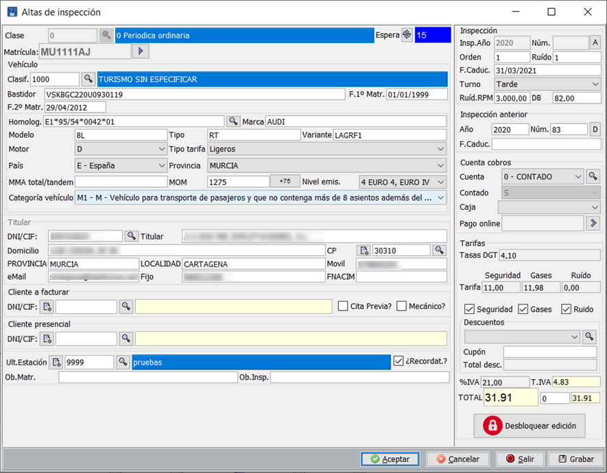