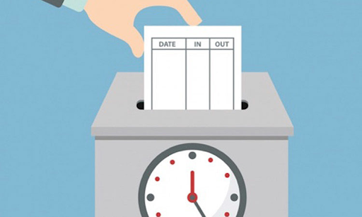

# Módulo Control Horario

## Que es el módulo de control horario

Es un módulo que permite controlar el nº de horas trabajadas de cada uno de los empleados de la estación.

La estación puede establecer los horarios de trabajo que deben respetar los empleados, a la vez que puede sacar informes sobre cada uno de ellos a final de mes para que sean firmados.

Los empleados pueden consultar las horas trabajadas y saber si cumplen con el horario de la estación.

## Uso de control horario

El control horario de creativa puede ser usado por todos los usuarios de la estación. De forma automática cuando se registran en el programa al inicio de la jornada y de forma manual para el resto de marcajes en su propio equipo o en un equipo que actúa de controlador de horario.

Los usuarios normales pueden realizar marcajes y consultarlos. No tienen permitido realizar más operaciones.

Los usuarios administradores o los que tienen permisos para gestionar el control horario, pueden además de realizar sus marcajes, realizar labores de configuración y mantenimiento del sistema de control horario. 

### **Marcajes automáticos de entrada**

El hecho de iniciar sesión en el programa o en la tablet, creará el primer marcaje de la jornada y será de tipo automático.

A partir de ese momento, el resto habrá que hacerlos manualmente y serán de tipo manual.

### **Marcajes manuales desde aplicación de escritorio**

Existen dos formas de crear marcajes manuales. La primera de ellas es exclusivamente para los que trabajan a diario delante de los equipos que ejecutan el programa. La segunda es para todos los usuarios, tanto de equipos como de tablet.

#### **Marcaje manual desde la aplicación.**

En la pantalla principal de la aplicación hay disponible un nuevo botón "**Marcar salida**" que muestra un menú para seleccionar el motivo.

![][image1]![][image2]

#### **Marcaje manual desde controlador de horarios**

Aunque cada usuario puede realizar marcajes manuales en su equipo o dispositivo, en la estación se puede emplear un lector o dispositivo de entrada conectado a un equipo (exclusivo o compartido) que registre mediante un TAG o Tarjeta de proximidad u otro medio (consultar dispositivos compatibles) los marcajes que se van produciendo a lo largo de la jornada.

El usuario dispone de una pantalla de acceso, donde verá información relativa a su marcaje.

![][image3]

Esta pantalla permanecerá siempre visible para que los usuarios puedan ir pasando sus identificadores o escribiendo su pin o inicio de sesión uno detrás de otro.

##### Activar el controlador

El ordenador que actúa como control de horarios debe tener en marcha un servicio. Este servicio se llama ***Control Horario proceso***.

El controlador de control horario se encuentra en *Mantenimiento \> Gestión de usuarios \> Control Horario*.

Seleccionando la opción ***Control Horario proceso***, se pondrá a la vista la ventana que se ha mostrado en el punto anterior.

#### **Marcajes desde ITVAndroid (Tablet)**

Desde la tablet, a parte del marcaje que de forma automática se realiza, se ha añadido al menú superior la opción marcaje manual.

Cuando se pulsa sobre la opción “Marcar salida” mostrará la pantalla para seleccionar el tipo de marcaje.

Y haciendo clic sobre un tipo de marcaje, se realiza, mostrando mensaje de confirmación.

## Configuración y gestión de Control Horario para administradores

Todos los puntos de esta sección son para el uso por parte de administradores o personal autorizado, ya que permiten la consulta y/o modificación de los fichajes de todos los trabajadores.

### **Requisitos previos**

El control horario solo funcionará correctamente con usuarios que cumplan ciertos requisitos, por lo que previamente al uso de este módulo, se deben comprobar los siguientes elementos de esta lista:

- **Listado de usuarios actualizado**. Disponible desde el menú *Archivo \> Seguridad \> Usuarios*. Asegurarse de que están todos activos y desactivar los que ya no estén trabajando en la estación.  
- **Los usuarios deben tener DNI**. Todos los usuarios que vayan a utilizar el servicio de control horario, deben tener asignado un DNI. Desde el menú *Mantenimiento \> Gestión de Usuarios \> Propiedades de los usuarios*, se puede acceder a cada usuario para añadir su DNI.

Se selecciona el usuario y se pulsa *Editar datos personales* (que sea un usuario real) y se cumplimenta el campo DNI.

![][image4]

### **Configuración**

A continuación se deben crear los distintos horarios de los usuarios de la empresa, agregar listado de días festivos, asignar una identificación a cada usuario para que pueda hacer la entrada o la salida.

Una vez se hayan obtenido marcajes por parte de los usuarios, se pueden obtener los listados de Marcajes, que contendrán toda la información almacenada durante los periodos que se soliciten.

Para que la aplicación esté disponible para realizar los marcajes, es necesario ejecutar un proceso que se mantenga en pantalla, presentando el menú de hacer el marcaje a los trabajadores.

#### **Horarios de usuarios**

Accesible desde *Mantenimiento \> Gestión de usuarios \> Control horario \> Horarios de usuarios*.

Muestra el listado de horarios disponibles para el uso.

![][image5]

##### Crear horario

Para la creación de un nuevo horario, pulsar Nuevo y cumplimentar los campos disponibles.

![][image6]

- **ID**: nº de horario. Si no se especifica, el programa asigna automáticamente este nº.  
- **Nombre**: Denominación que queremos dar a este horario y que servirá para identificarlo en otras partes del programa.  
- **Hora de entrada y de salida**: La hora en la que comienza la jornada laboral y termina.  
- **Inicio y fin del descanso**: En el caso de ser jornadas en las que hay una interrupción (comida por ejemplo), la hora de comienzo y de fin de la pausa.

Una vez introducidos los datos, pulsar sobre el botón *Aceptar (aspa verde)*, y a continuación en *Salir*.

Como se puede ver en la imagen inferior, se han agregado los horarios.

![][image7]

##### Modificar horario

Para modificar un horario seleccionar el horario y pulsar en Modificar.

![][image8]

Para cambiar los valores de cada campo, eliminar el contenido y volver a escribir la hora y los minutos.

#### **Listado de días festivos**

Permite asignar los días festivos comunes o los aplicables a cada usuario.

![][image9]

Estos días serán tenidos en cuenta únicamente en la generación de marcajes automáticos, ya que de forma manual (realizado el marcaje por el usuario) prevalece que el usuario está presente en ese momento.

##### Alta de día festivo

Pulsando el botón Nuevo, se accede al formulario donde se puede elegir el día.

Seleccionar una fecha, un nº de Usuario (se puede buscar entre los existentes mediante la lupa) y una descripción que permita identificarlo correctamente.

#### **Identificación de usuarios**

La identificación de los usuarios es necesaria para realizar los marcajes. Un usuario no puede realizar el marcaje si no dispone de algún elemento que lo identifique.

En el listado se muestran todos los usuarios que tienen asignado un identificador. Dicho identificador puede ser un PIN, una tarjeta de proximidad, un ID obtenido mediante sensor de huella, etc..

Un usuario puede disponer de más de un tipo de identificador o de varios identificadores del mismo tipo, aunque no es habitual su uso. En el caso de extravío de su identificador se debe eliminar el que tuviese y crear uno nuevo.

##### Alta de un nuevo identificador de usuario

Con este proceso se asocia un identificador a un usuario.

Para realizar el alta, pulsa en Nuevo y cumplimenta los campos:

- **Cod. Usuario**: Selecciona un usuario de la lista.  
- **Tipo de ID**: elige si es PIN, Tarjeta..  
- **ID**: escribe el PIN deseado o pasa la tarjeta por el lector conectado al equipo y se rellenará.  
- **Fecha de Inicialización**: Se establecerá de forma automática al guardar con la fecha actual o bien, establecer la fecha real de alta del identificador.

![][image10]

##### Modificación de identificadores de usuario

Para editar un identificador de usuario, pulsar Editar.

![][image11]

Solo se puede reasignar a un nuevo usuario o bien cambiar la fecha de Inicialización de cuando fue creado.

#### **Listado de Marcajes**

En esta pantalla se muestran todos los marcajes efectuados por los usuarios de la aplicación que están habilitados en el control horario (DNI cumplimentado en Propiedades de usuario).

Mediante el filtro de la parte superior se puede seleccionar el periodo (por defecto el mes actual) y el usuario. Dejando en blanco el campo del usuario sale el listado de todos.

![][image12]

Desde esta pantalla se pueden crear marcajes manuales, editar los existentes, imprimir la hoja resumen de marcajes o generar los marcajes entre fechas.

#### **Control Horario Proceso**

La pantalla donde fichan o realizan los marcajes los usuarios se muestra cuando se ejecuta el “proceso de control horario” (de la misma forma que se utiliza el “proceso de máquinas”) en uno de los equipos de la estación.

![][image13]

En esta pantalla cada usuario introducirá o seleccionará su usuario y escribirá su contraseña o bien puede escribir su ID (asignado manualmente o en base a una tarjeta de proximidad).

## Control Horario para usuarios

Existen dos formas de realizar un marcaje. Bien de forma automática mediante la autenticación que realiza el usuario en la aplicación o en la tablet o bien con un método de identificación tal como un PIN o una tarjeta de proximidad.

El usuario realizará los diferentes marcajes de la siguiente forma:

Marcaje de entrada:

- De forma automática: Utilizando la aplicación de escritorio, la primera vez que inicie la sesión (seleccione su usuario e introduzca la contraseña) en el día. Los inspectores, de forma similar en la tablet al introducir su usuario y contraseña la primera vez.  
- De forma manual: En un ordenador específico con la pantalla de marcajes visible, usando el selector de usuario e introduciendo la contraseña correspondiente o bien introduciendo un identificador (PIN, Tarjeta, etc.).

Resto de marcajes:

Los usuarios de la aplicación de escritorio dispondrán de una opción en el escritorio que les permitirá seleccionar el motivo y crear el marcaje.

![][image14]

De forma adicional y para los usuarios que utilicen la tablet o móvil con la app ITV Android, podrán efectuar su marcaje de salida desde el menú, seleccionando la opción “Marcar salida”

### **Mi control de horario**

Desde esta pantalla cada usuario puede comprobar su listado de marcajes, así como el motivo de salida si lo hubo.

![][image15]

Se muestra una línea por cada pareja de marcajes, es decir, uno de entrada y otro de salida. Por lo tanto, al final del día o jornada, los marcajes siempre deben ser pares.

Como los marcajes de entrada se realizan de forma automática al abrir la aplicación, si falta un marcaje manual (no se ha realizado la acción de marcaje de salida en la aplicación de escritorio o en la app) el responsable debe rellenar los faltantes cuando esté regularizando a cada usuario.

Se puede obtener un informe con todos los marcajes para el mes o meses que indique.

![][image16]

[image1]: <images/image1.png>

[image2]: <images/image2.png>

[image3]: <images/image3.png>

[image4]: <images/image4.png>

[image5]: <images/image5.png>

[image6]: <images/image6.png>

[image7]: <images/image7.png>

[image8]: <images/image8.png>

[image9]: <images/image9.png>

[image10]: <images/image10.png>

[image11]: <images/image11.png>

[image12]: <images/image12.png>

[image13]: <images/image13.png>

[image14]: <images/image14.png>

[image15]: <images/image15.png>

[image16]: <images/image16.png>